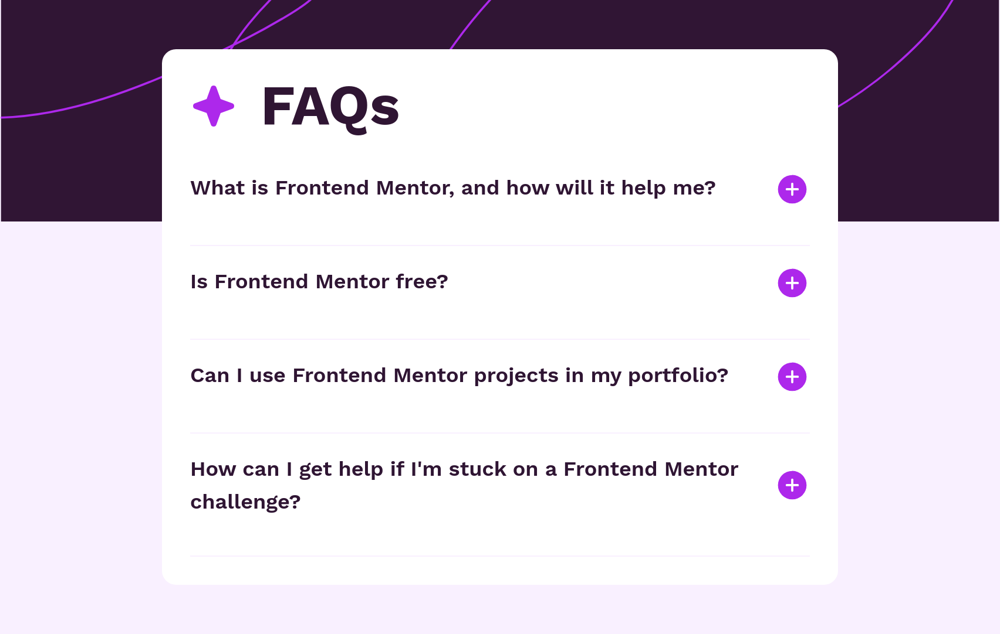

# Frontend Mentor - FAQ accordion solution

This is a solution to the [FAQ accordion challenge on Frontend Mentor](https://www.frontendmentor.io/challenges/faq-accordion-wyfFdeBwBz). Frontend Mentor challenges help you improve your coding skills by building realistic projects. 

## Table of contents

- [Frontend Mentor - FAQ accordion solution](#frontend-mentor---faq-accordion-solution)
  - [Table of contents](#table-of-contents)
  - [Overview](#overview)
    - [The challenge](#the-challenge)
    - [Screenshot](#screenshot)
    - [Links](#links)
  - [My process](#my-process)
    - [Built with](#built-with)
    - [Useful resources](#useful-resources)
  - [Author](#author)

**Note: Delete this note and update the table of contents based on what sections you keep.**

## Overview

### The challenge

Users should be able to:

- Hide/Show the answer to a question when the question is clicked
- Navigate the questions and hide/show answers using keyboard navigation alone
- View the optimal layout for the interface depending on their device's screen size
- See hover and focus states for all interactive elements on the page

### Screenshot

### Links

- Solution URL: [Solution](https://github.com/Adnan0-IM/faq-accordion)
- Live Site URL: [Live Demo](https://your-live-site-url.com)

## My process

### Built with

- Semantic HTML5 markup
- CSS custom properties
- Flexbox
- CSS Grid
- Mobile-first workflow
- [React](https://reactjs.org/) - JS library
- [Tailwind CSS](https://tailwindcss.com/) - For styles

### Useful resources

- [React Icons](https://react-icons.github.io/react-icons/) - Comprehensive icon library for React applications
- [Tailwind CSS Documentation](https://tailwindcss.com/docs) - Essential reference for Tailwind CSS classes and utilities
- [MDN Web Docs](https://developer.mozilla.org/) - Detailed documentation for HTML, CSS, and JavaScript

## Author

- Website - [Adnan Iliyasu](https://adnan0-im.github.io/Frontend-Basics-Portfolio/)
- Frontend Mentor - [@Adnan0-IM](https://www.frontendmentor.io/profile/Adnan0-IM)
- Twitter - [@Adnan_imd](https://www.twitter.com/Adnan_imd)